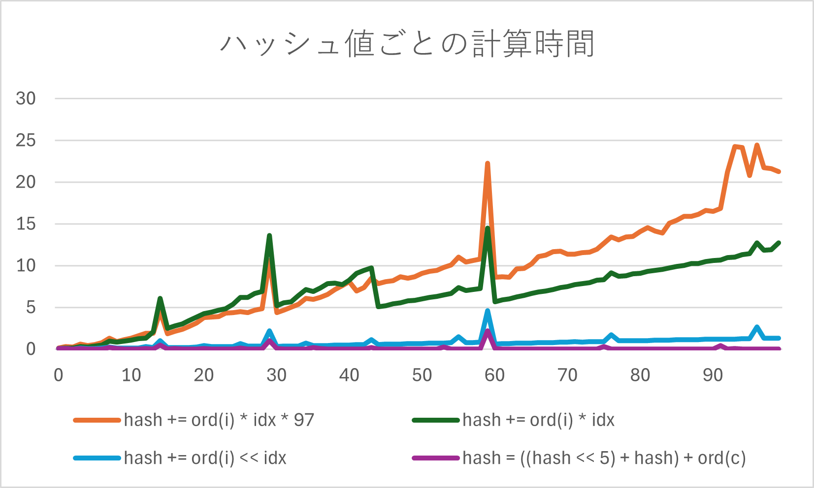
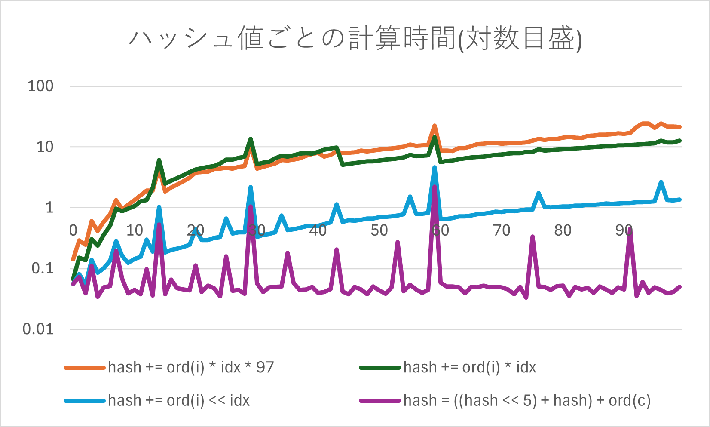
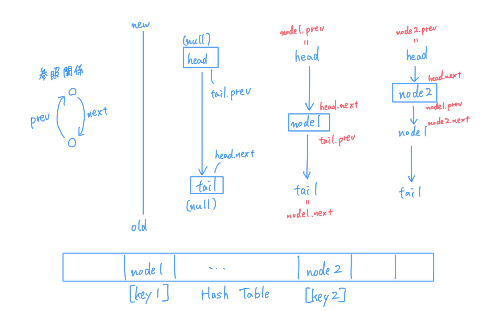

####宿題 1
計算時間を、ハッシュ値の決め方別にグラフ化してみた。

また、対数グラフに変換すると、単なるビットシフトの加算よりも調べて出てきた効率の良いやり方の方が 10 倍時間が短いことが分かった。

####宿題 2

- 木構造の方が、データに順序がある/つけたいときに管理が容易
  - 付随して、何かしらのデータで条件絞り込み(あてはまるものを抽出など)することができる
- データの変化量が急激な場合(を想定する場合)、ハッシュ値の衝突が起こり O(1)から遠ざかるまたは頻繁に再ハッシュをする必要がある、ハッシュテーブルを用いるメリットが減る

####宿題 3

- 順序を管理するために、アクセスが自分より前の要素、後の要素を記録するノードを作成する。
- 双方向リストを作成(単方向よりも削除が簡単)

1. 初めてそのページにアクセスする場合
   - tail と tail.prev の間に自身をつなぐ
2. キャッシュにふくまれるページにアクセスする場合
   - そのページのノードを削除(node.prev と node.next をつなぎ)、1 と同様に最新アクセスとして追加

######作成したコードの説明

- `ListNode`クラス：双方向リストのノードを表す。
  key：URL
  value：contents
  prev：前のノードを指すポインタ
  next：次のノードを指すポインタ
- `Cache`クラス：キャッシュのサイズ n、現在のアイテム数 count、双方向リストの先頭(最もアクセスが古いデータ)tail、双方向リストの最後(最新アクセスのあったデータ)head、ハッシュテーブル nodes(今回はサイズ 97、課題 1 のようなデータの増減に応じたサイズ変更には対応していない)

- はじめに`self.head`と`self.tail`を繋いでおく。head と tail はハッシュテーブル上には存在しない。
- `calculate_hash`で、キーである URL に対してハッシュ値を計算。
- `_remove`で、引数の node をリストから削除
  - node の一つ前のノードと後のノードをお互いに繋ぐ処理
- `_add_to_tail`で引数に与えた node をリストの先頭(最も最近アクセスされた位置)に追加
  - 今先頭にあるノード(self.head.next)を node に変更 -　 node の前後は head と、もともと先頭にあったノードなのでそのように繋ぎなおす
- `access_page`でキャッシュへの追加/更新を行う
  1. ハッシュ値を計算し対応するインデックスを取得
  2. ハッシュテーブル内を検索し、すでにキャッシュに存在する場合は一度そのノードを`_remove`し、改めて先頭に追加。存在しない場合は新しくノードを作成し、先頭に追加。
  3. キャッシュがいっぱい(2 の追加の時点でオーバーしている場合あり)のときは最もアクセスが古いノード`self.tail.prev`を削除
- `get_pages`で、キャッシュ内のページを順序付きで返す
  
